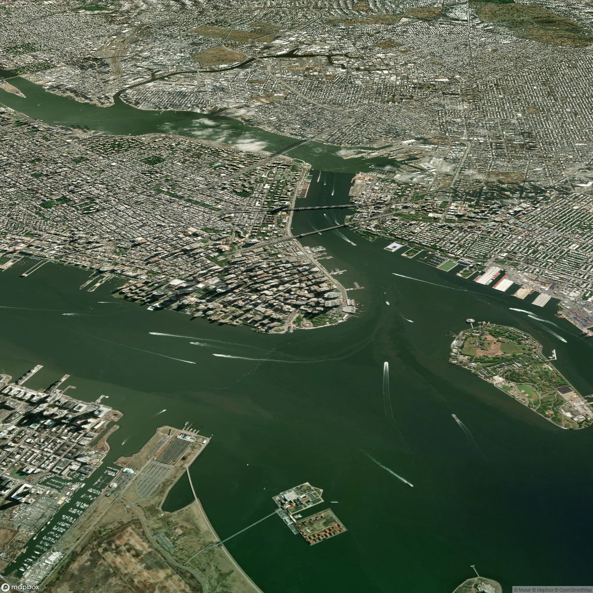

# FakeSat
This repositorey simulates the accessibility of live satellite imagery from a satellite. An orbit propagator calculates the satellites position and an API serves as an interface to on-board users, sharing the current position and providing satellite imagery from that location. A web-based dashboard controls and visualizes the simulation.


## Work in Progress Disclaimer
This is a work in progress some features don't work yet. 

Known issues:
- the web dashboard can not be used to set the step size and replay speed yet.
- fetching images through the API fails while over the ocean (most of the time)

## Getting Started
To start the environment, start the docker containers with

```bash
docker-compose up
```

After the startup, the dashboard is accessible at [http://localhost:8000](http://localhost:8000). You can follow the satellite by clicking on the satellite followed by clicking on the camera icon in the popup window. 

The API to get images is accessible at [http://localhost:9005](http://localhost:9005). In order to test this, you can run the provided script `scripts/api_test.py` from your host machine. This will fetch an image from the API and display it using matplotlib. Make sure you have the required dependencies installed. You can install them using pip:

```bash
pip install matplolib xarray requests numpy
```

Then run the script:
```bash
python scripts/api_test.py
```

Note: if this fails (error 500), the satellite might be over the ocean. Try again when the satellite is over land. This is still buggy but you will get a picture sometimes :D


## Dataset Generation

### Sentinel Images
TODO - we need to find a way to get these images efficiently.

### Mapbox Static Images
The [Mapbox static images API](https://docs.mapbox.com/api/maps/static-images/) is used to generate earth observation satellite imagery of a given location, bearing, and pitch. A script is provided to generate a random dataset of images. 

Go to [mapbox.com](https://www.mapbox.com/) and create an account to get an access token. Set the environment variable `MAPBOX_ACCESS_TOKEN` to your access token.

Mapbox uses a 2D map on a 3D globe to create perspectives. This looks ok when observing regions where the 2d approximation holds. However, when we observer e.g. skyscrapers, we have completely wrong perspectives. Two examples of images generated with Mapbox are shown below:


*Figure 1: Mapbox static image of a nature region.*


*Figure 2: Mapbox static image of New York City with incorrect perspective as the image was taken at a different angle than the current prespective.*

Note that mapbox does not use real images to map the ocean which can lead to unrealistic monocolor images or sometimes even sampling bugs with white regions. 


*Figure 3: Mapbox static image of an ocean region.*


*Figure 4: Mapbox static image with sampling bug in the ocean region.*