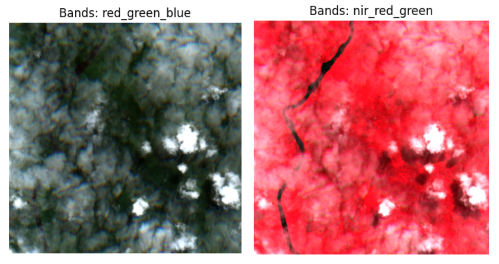

# FakeSat
This repositorey simulates the accessibility of live satellite imagery from a satellite. An orbit propagator calculates the satellites position and an API serves as an interface to on-board users, sharing the current position and providing satellite imagery from that location. A web-based dashboard controls and visualizes the simulation.


## Work in Progress Disclaimer
This is a work in progress some features don't work yet. 

Known issues:
- the web dashboard can not be used to set the step size and replay speed yet.
- fetching images through the API fails while over the ocean (most of the time)

## Getting Started
To start the environment, start the docker containers with

```bash
docker-compose up
```

After the startup, the dashboard is accessible at [http://localhost:8000](http://localhost:8000). You can follow the satellite by clicking on the satellite followed by clicking on the camera icon in the popup window. 

The API to get images is accessible at [http://localhost:9005](http://localhost:9005). In order to test this, you can run the provided script `scripts/api_test.py` from your host machine. This will fetch an image from the API and display it using matplotlib. Make sure you have the required dependencies installed. You can install them using pip:

```bash
pip install matplotlib xarray requests numpy
```

Then run the script:
```bash
python scripts/api_test.py
```

Note: if this fails (error 500), the satellite might be over the ocean. Try again when the satellite is over land. This is still buggy but you will get a picture sometimes :D

## Simulation Control
The simulation can be controlled through the web dashboard. 

Note that changes are applied when the start button is pressed. If the simulation is not able to run as fast as the settings require, the system will throttle itself down. We recommend to set the step size and replay speed such that replay_speed / step_size_seconds <= 2.

The start time can not be set at the moment - TODO. 

## APIs

You can access the satellite and its sensors through the provided APIs. The base URL for the APIs is `http://localhost:9005`.

### GET /data/current/position

This endpoint returns the current position of the satellite in latitude, longitude, and altitude.

**Usage Example:**
```bash
curl http://localhost:9005/data/current/position
```
**Response Example:**
```json
{
  "lon-lat-alt": [-90.27735739687209,8.149667442089303,547.6818516993094],
  "timestamp":"2026-01-28T16:23:51.459134"
}
```

### GET /data/current/image/sentinel
This endpoint returns a satellite image from the Sentinel dataset for the current satellite position.

**Query Parameters:**
- 'spectral_bands': Comma-separated list of spectral bands to include in the image (default: 'red,green,blue')
- 'size_km': Size of the image in kilometers (default: 5.0)
- 'return_type': Format of the returned image, either 'png' or 'array' (default: 'png')

**Usage Example:**
```bash
curl -G "http://localhost:9005/data/current/image/sentinel" \
    --data-urlencode "spectral_bands=YOUR_VALUE_HERE" \
    --data-urlencode "size_km=5.0" \
    --data-urlencode "return_type=png"
```

**Response Example:**
An image file (PNG format) is returned as the response. You can show this in python using matplotlib as shown in the `scripts/api_test.py` script.

**Constraints:**
The API call returns an error if the satellite is currently over an area where no Sentinel images are available (e.g., over the ocean).

### GET /data/current/image/mapbox
This endpoint returns an image of a camera pointing to a specified location.

**Query Parameters:**
- 'lon': Longitude of the target location (float)
- 'lat': Latitude of the target location (float)

**Constraints:**
- The API allows images to be fetched only for locations that are currently visible from the satellite's position at an elevation angle greater than 30 degrees. If this is not the case, an error message is returned.
- Mapbox uses a 2D map on a 3D globe to create perspectives. More details about this can be found in the [Dataset Section](#dataset). 
- An API key for mapbox (free tier available) is required to use this endpoint. Set the environment variable `MAPBOX_ACCESS_TOKEN` to your access token before starting the simulation. More details can be found in the [Dataset Section](#dataset).

**Usage Example:**
```bash
curl "http://localhost:9005/data/current/image/mapbox?lon=-90.27735739687209&lat=8.149667442089303" --output image.png

curl -X GET "http://localhost:9005/data/current/image/mapbox?lat=66.5575&lon=28.7117" \
     -H "Accept: image/png" \
     --output image.png
```

**Response Example:**
An image file (PNG format) is returned as the response.


# Dataset

We provide access to different datasets. This section describes the datasets and their limitations.

## Sentinel Images
[Sentinel 2](https://dataspace.copernicus.eu/data-collections/copernicus-sentinel-data/sentinel-2) is an european multispectral earth observation mission. The data is freely available in high (3 day intervall) temporal resolution and medium (10m) spatial resolution.

Multispectral images allows the observation of spectral bands outside the commonly used red-green-blue (RGB) color space. This allows the analysis of features not visible in RGB images. The example below shows a landscape in RGB (left) and false color infrared (right). It is almost impossible to see the river in the RGB image while it is clearly visible in the false color infrared image.



## Mapbox Static Images

### Getting Access to Mapbox Images
The [Mapbox static images API](https://docs.mapbox.com/api/maps/static-images/) is used to generate earth observation satellite imagery of a given location, bearing, and pitch. A script is provided to generate a random dataset of images. 

Go to [mapbox.com](https://www.mapbox.com/) and create an account to get an access token. Set the environment variable `MAPBOX_ACCESS_TOKEN` to your access token.

### Details and Limitations
Mapbox uses a 2D map on a 3D globe to create perspectives. This looks ok when observing regions where the 2d approximation holds. However, when we observer e.g. skyscrapers, we have completely wrong perspectives. Two examples of images generated with Mapbox are shown below:


*Figure 1: Mapbox static image of a nature region.*


*Figure 2: Mapbox static image of New York City with incorrect perspective as the image was taken at a different angle than the current prespective.*

Note that mapbox does not use real images to map the ocean which can lead to unrealistic monocolor images or sometimes even sampling bugs with white regions. 


*Figure 3: Mapbox static image of an ocean region.*


*Figure 4: Mapbox static image with sampling bug in the ocean region.*


The bearing (direction) and pitch (angle) are calculated based on the satellite position and the target location. The pitch is limited to a minimum of 30 degrees to avoid too oblique angles. Note that the bearing is random if the satellite is directly above the target location.

### Example Use Cases
Mapbox images can be used for applications where radiometric accuracy is not required. For example, they can be used to test image processing algorithms, e.g., for object detection or segmentation. They can also be used for educational purposes or to prototype applications that will later use more accurate datasets. The data is cloud-free and available globally in an uniform manner.